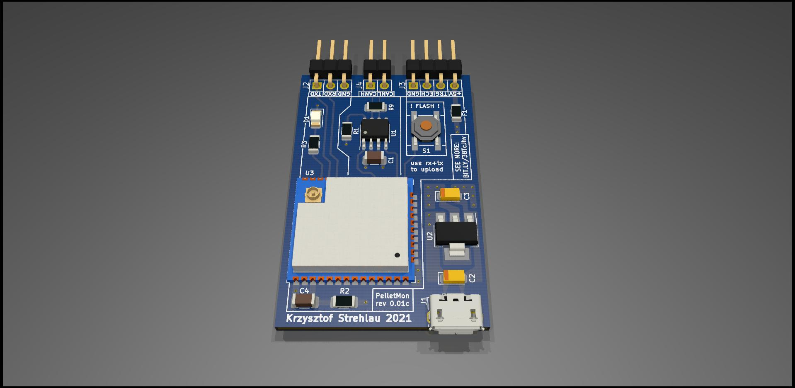
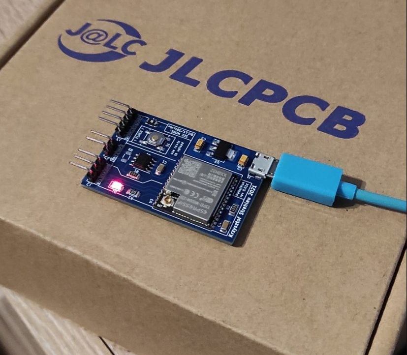

# WHAT AND WHY?

Our old boiler was previously connected to my IoT system. After replacing the boiler with a new one, we no longer have this option. So why not introduce it to a new boiler?

# THE TARGET

The goal of the project is to reverse engineer the CAN communication of the new boiler and expose real-time data to the IoT. By the way, the HC-SR04 sensor will measure the fuel level in the tank.

# DESIGN

The project will have its own PCB. Communication with the outside world will be carried out using ESP32 and fuel level measurement using HC-SR04. The SN65HVD230 chip will be used as the CAN transceiver. The software will be written in the Arduino environment in C ++ and will be powered with my IoT framework - ksIotFrameworkLib.

# KNOWN ISSUES

## HARDWARE

### rev 0.01a-0.01c
- GPIO0 is directly connected to SWITCH (S1), avoid setting direct HIGH state at that pin from software, because it can result in short circuit when pressing S1, as it will tie IO0 to ground directly.

## SOFTWARE
- Hardcoded CAN support.
- Sometimes at boot sends "zero" values to MQTT.
- No support for fuel level sensor.

# PICS

# Special thanks
- M-Works [ https://m-works.net/ ]
- Robert Ł.
